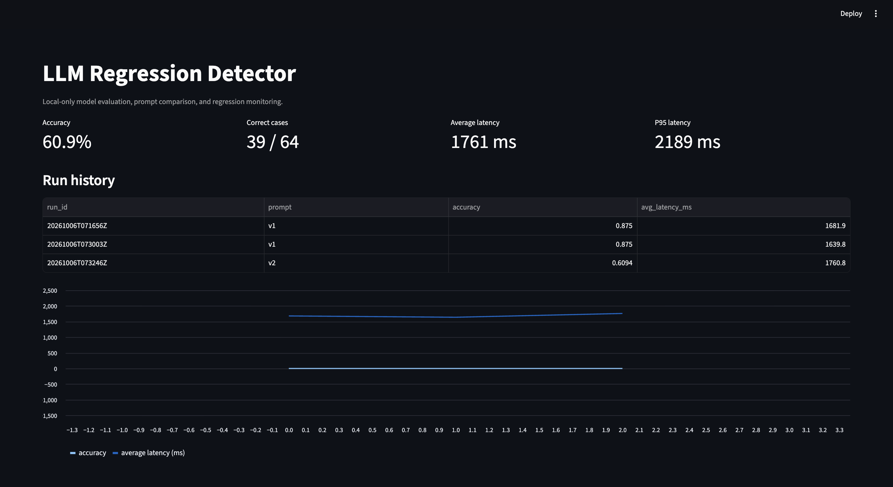
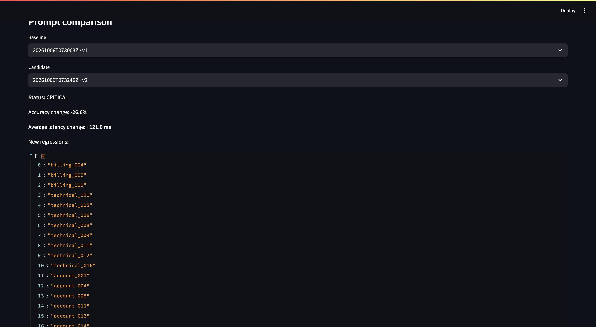

## Prompt Evaluation and Regression Detection

The project evaluates prompt changes using a golden dataset of 64 customer-support messages across four categories: `billing`, `technical`, `account`, and `general`.

A baseline evaluation is first run with prompt version `v1`. The system records:

- Total and correct classifications
- Overall accuracy
- Average latency
- P95 latency
- Prediction details for every test case

A candidate prompt, such as `v2`, can then be evaluated against the baseline. The regression engine identifies cases that were previously correct but became incorrect, calculates the accuracy change, and assigns a status:

- **PASS**: No meaningful quality degradation detected
- **WARNING**: New failed cases detected without a significant overall accuracy drop
- **CRITICAL**: Accuracy falls beyond the configured regression threshold

```bash
# Run and save a baseline evaluation
python -m evals.runner --prompt-version v1

# Run a candidate evaluation and compare it with the v1 run ID
python -m evals.runner --prompt-version v2 --compare-with YOUR_V1_RUN_ID
```

All evaluation results are stored locally in `data/evaluation_runs.jsonl`. The Streamlit dashboard visualizes historical runs, accuracy, latency, failed cases, and prompt-to-prompt regression reports.

```bash
streamlit run dashboard.py
```

This workflow makes it possible to test prompt updates before deployment and catch LLM quality regressions early, without relying on paid APIs or cloud services.

## Demo Screenshots

### Regression Monitoring Dashboard



### Baseline Evaluation



### Case Updates


